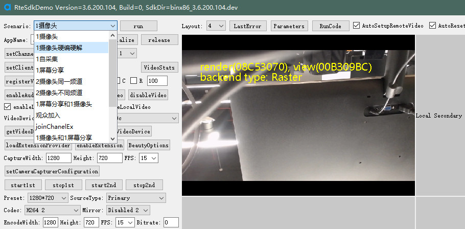

# AgoraRteDemo

The portable app that compiled by nuitka.
[http://yinkaisheng.ysepan.com](http://yinkaisheng.ysepan.com)

dll code [AgoraRtePythonDll](https://github.com/yinkaisheng/AgoraRtePythonDll)

使用代码执行时dll放置路径

Demo UI

强大的SDK API调用测试工具，一个demo可以调用任意版本SDK。
基于Python动态语言特性，demo可以实现任意顺序调用SDK API或API组合，编译API参数。
SDK回调执行时可以自动调用对应的Python回调函数，并在回调中执行任意逻辑调用。

延迟调用

回调中执行任意Python代码

配置文件AgoraRteDemo.config中可以配置调用各种场景对应的代码文件

